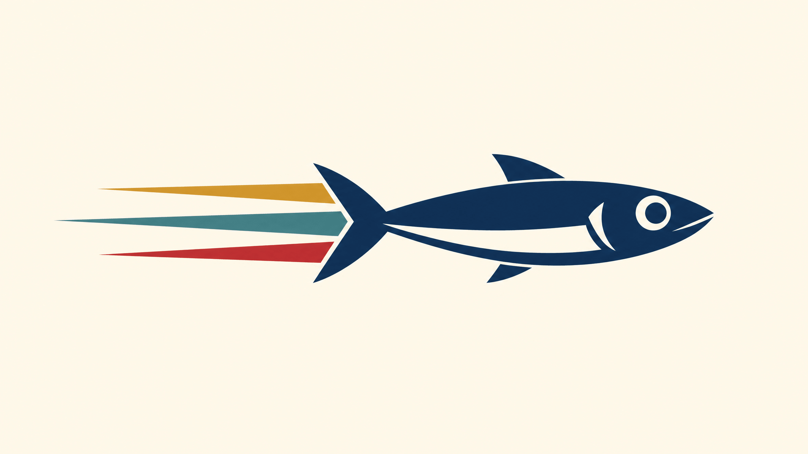
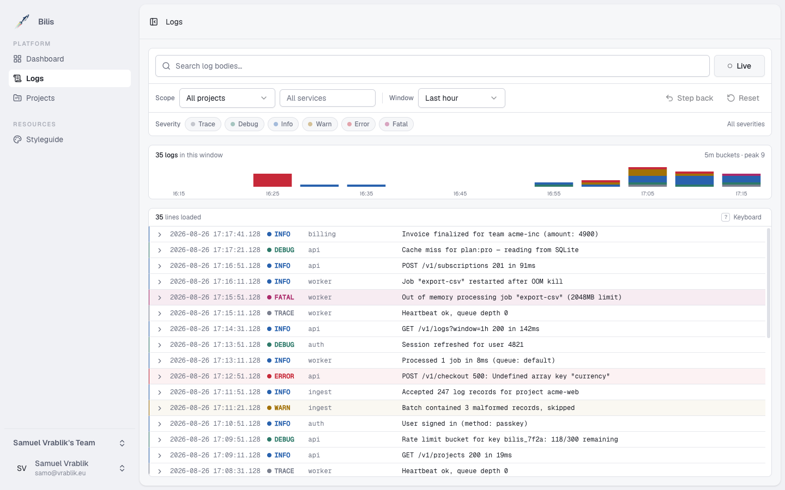

<p align="center">
  <picture>
    <source media="(prefers-color-scheme: dark)" srcset="public/bilis-dark.png">
    
  </picture>
</p>

<h1 align="center">Bilis</h1>

<p align="center">
  <strong>Self-hostable log storage and search.</strong><br>
  Point any OTLP-compatible shipper at one HTTP endpoint, and get a fast,<br>
  searchable, live-tailing view of your logs — backed by ClickHouse, on your own box.
</p>

<p align="center">
  <a href="https://github.com/bilisapp/bilis/actions/workflows/tests.yml"></a>
  <a href="LICENSE.md"></a>
  
  
  
</p>

---

<p align="center">
  <picture>
    <source media="(prefers-color-scheme: dark)" srcset="public/screenshot-logs-dark.png">
    
  </picture>
  <br>
  <sub>Log lines shown are illustrative — Bilis is pre-launch.</sub>
</p>

**v1 is exactly that — nothing else.** No traces, metrics, alerting, dashboards, saved searches, or billing.

## How it works

- **Ingest** — `POST /api/v1/logs` accepts OTLP/HTTP (JSON encoding), `POST /api/v1/ingest` accepts a simple JSON shape (`{"level": "error", "message": "...", "service": "...", "context": {...}}`). An API key resolves to a project; malformed records are skipped best-effort — ingest never returns 400, and overload returns 503 with `Retry-After`.
- **Storage** — an OTel-compatible `otel_logs` MergeTree table in ClickHouse (async inserts, token bloom filter on `lower(Body)`, `ProjectId`-first ordering, 30 day TTL). Schema and its rules: [`database/clickhouse/SCHEMA.md`](database/clickhouse/SCHEMA.md).
- **UI** — per-team log viewer: time range, project/service/severity filters, full-text search, expandable rows, live tail.

## Stack

Laravel 13 (PHP 8.4) · Inertia v3 + Vue 3 · Tailwind v4 · ClickHouse (HTTP interface, no client dependency) · SQLite for app data · Pest.

## Getting started

Requires PHP 8.4, Node 22+, and a reachable ClickHouse server.

```bash
composer install && npm install
cp .env.example .env && php artisan key:generate

# ClickHouse connection (defaults: 127.0.0.1:8123, database "bilis")
# -> set CLICKHOUSE_* in .env, then create the database + otel_logs table:
php artisan clickhouse:migrate
# the schema is still pre-1.0: if you already have a dev otel_logs table from an
# earlier checkout, DROP TABLE it first — migrate is CREATE ... IF NOT EXISTS.

# App database + demo team/project/API key (the key is printed once)
php artisan migrate --seed

composer run dev
```

Send a first log:

```bash
curl -X POST http://localhost:8000/api/v1/ingest \
  -H "Authorization: Bearer bilis_..." \
  -H "Content-Type: application/json" \
  -d '{"level":"info","message":"hello bilis","service":"demo"}'
```

Then open `/{team-slug}/logs`. An OTLP exporter needs `OTEL_EXPORTER_OTLP_PROTOCOL=http/json`, endpoint `https://your-host/api/v1`, and the API key as a bearer token.

## Development

```bash
php artisan test --compact        # Pest test suite
vendor/bin/pint --dirty           # PHP formatting
vendor/bin/phpstan analyse        # static analysis
npm run build                     # frontend build (vue-tsc + vite)
```

The design system — palette, tokens, severity colours, every component — lives at `/styleguide` (any logged-in user). Agent/contributor conventions are in `CLAUDE.md` / `AGENTS.md` and `.ai/rules/`.

## License

[Functional Source License, Version 1.1, ALv2 Future License](LICENSE.md) (`FSL-1.1-ALv2`).

In plain terms: **self-host Bilis freely** — for your company's internal use, for education, for research, and as part of professional services you provide to someone else running it. The one thing you may not do is offer Bilis (or a substantially similar log-search product built from it) to others as a commercial product or hosted service.

Every release converts to the **Apache License 2.0 two years after it is published**, so this code becomes fully open source on a rolling schedule.

Bilis is *source available*, not OSI open source. Contributions are welcome under the same terms.
