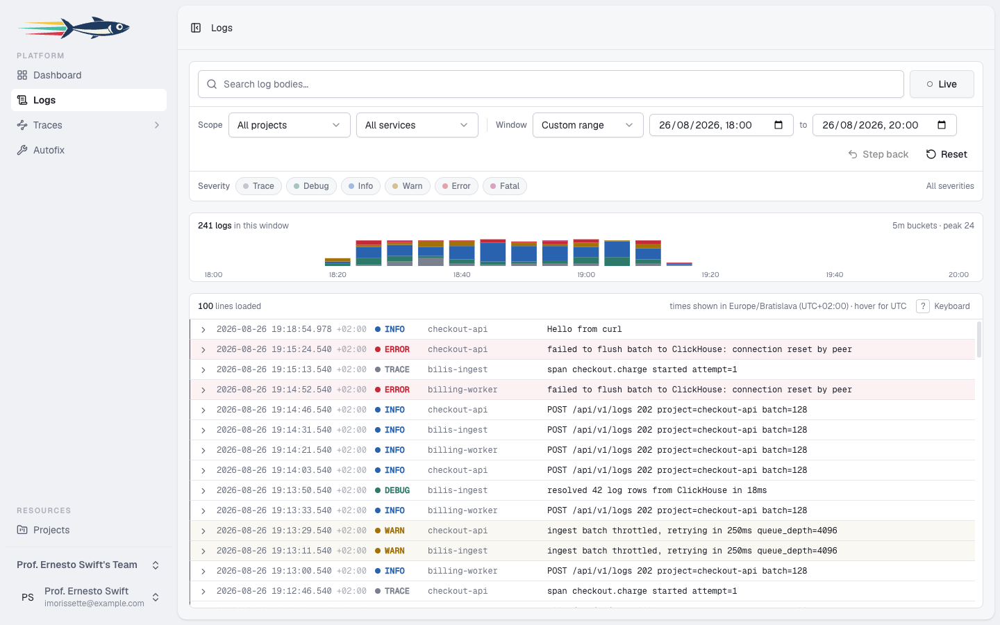

<p align="center">
  <picture>
    <source media="(prefers-color-scheme: dark)" srcset="public/bilis-dark.png">
    
  </picture>
</p>

<h1 align="center">Bilis</h1>

<p align="center">
  <strong>Observability your coding agent can read.</strong><br>
  Self-hosted logs, traces and metrics on ClickHouse, speaking plain OpenTelemetry.<br>
  One <code>claude mcp add</code> and Claude Code can ask production why it broke.
</p>

<p align="center">
  <a href="https://github.com/bilisapp/bilis/actions/workflows/tests.yml"></a>
  <a href="#license"></a>
  
  
  
</p>

---

<p align="center">
  <picture>
    <source media="(prefers-color-scheme: dark)" srcset="public/screenshot-logs-dark.png">
    
  </picture>
</p>

```bash
claude mcp add --transport http bilis https://your-bilis-host/mcp
```

> *"Checkout started returning 500s around 14:00 — find out why."*
>
> Claude calls `error-summary`, pulls the failing request with `get-trace`, sees the payment span timing out after a deploy, reads the matching logs with `search-logs`, and opens the file that needs fixing — in the repo it is already working in.

## Why Bilis

- **Built for agents as well as people.** A remote MCP server with ten read-only tools (`search-logs`, `error-summary`, `list-traces`, `get-trace`, `service-latency`, `list-metrics`, `query-metric`, …). It signs in with OAuth and a consent screen, so there is no key to copy into a config file. Works with Claude Code, Claude Desktop, Cursor and any other MCP client.
- **OpenTelemetry in, no SDK of ours.** Point any OTLP/HTTP exporter at it (JSON or protobuf). There's also a Monolog channel for Laravel, a one-line Linux host agent, and a DSN endpoint for existing error-reporting SDKs ([docs](resources/docs/ingestion/sentry.md)).
- **Yours.** One box, your data, ClickHouse underneath. Self-hosted, there is no per-GB bill and no per-seat price.
- **Small on purpose.** Logs, traces and metrics, linked to each other. No alerting, user-defined dashboards or saved searches.

## Quickstart (Docker)

```bash
git clone https://github.com/bilisapp/bilis && cd bilis
echo "APP_KEY=base64:$(openssl rand -base64 32)" >> .env
docker compose up -d
```

Open <http://localhost:8080>, register, create a project and an API key, then send a first line:

```bash
curl -X POST http://localhost:8080/api/v1/ingest \
  -H "Authorization: Bearer bilis_..." \
  -H "Content-Type: application/json" \
  -d '{"level":"error","message":"hello bilis","service":"demo"}'
```

Connect your agent with `claude mcp add --transport http bilis http://localhost:8080/mcp`. For anything beyond a laptop, put a TLS-terminating proxy in front and set `APP_URL`. The stack is web, Horizon, the scheduler, Redis and ClickHouse 26.2+, all in [`docker-compose.yml`](docker-compose.yml).

## How it works

- **Ingest** — `POST /api/v1/logs` accepts OTLP/HTTP (JSON or protobuf), `POST /api/v1/ingest` accepts a simple JSON shape (`{"level": "error", "message": "...", "service": "...", "context": {...}}`), `POST /api/v1/traces` accepts OTLP spans, and `POST /api/v1/metrics` accepts OTLP metrics (all five types). An API key resolves to a project; malformed records are skipped best-effort — ingest never returns 400, and overload returns 503 with `Retry-After`. OTLP over gRPC is not supported, which matters because collectors default to it.
- **Storage** — OTel-compatible `otel_logs`, `otel_traces` and five `otel_metrics_*` MergeTree tables in ClickHouse (async inserts, a `text` index on `lower(Body)`, `ProjectId`-first ordering, 30 day TTL), plus a `trace_summary` aggregate kept for 90 days. Requires ClickHouse **26.2+**. Schema and its rules: [`database/clickhouse/SCHEMA.md`](database/clickhouse/SCHEMA.md).
- **UI** — per-team log viewer (time range, project/service/severity filters, full-text search, expandable rows, live tail), trace viewer (trace list, span waterfall, per-service latency), and metrics explorer (rates, levels and percentiles, filtered and grouped by attribute). A log line links to its trace and a span links back to its logs.
- **Agents** — the MCP server above, plus Autofix, which turns recurring errors into agent-written pull requests, with the waterfall of the failing request attached.

## Stack

Laravel 13 (PHP 8.4) · Inertia v3 + Vue 3 · Tailwind v4 · ClickHouse (HTTP interface, no client dependency) · SQLite for app data · Pest.

## Running from source

Requires PHP 8.4, Node 22+, and a reachable ClickHouse server.

```bash
composer install && npm install
cp .env.example .env && php artisan key:generate

# ClickHouse connection (defaults: 127.0.0.1:8123, database "bilis")
# -> set CLICKHOUSE_* in .env (ClickHouse 26.2+), then create the database and tables:
php artisan clickhouse:migrate

# Upgrading an install that predates the text body index? migrate swaps the index
# definition instantly; this rebuilds it for rows written before the swap. Run it
# once, deliberately — it is not part of migrate, which runs on every boot.
php artisan clickhouse:materialize-index

# App database + demo team/project/API key (the key is printed once)
php artisan migrate --seed

composer run dev
```

Send a first log:

```bash
curl -X POST http://localhost:8000/api/v1/ingest \
  -H "Authorization: Bearer bilis_..." \
  -H "Content-Type: application/json" \
  -d '{"level":"info","message":"hello bilis","service":"demo"}'
```

Then open `/{team-slug}/logs`. An OTLP exporter needs `OTEL_EXPORTER_OTLP_PROTOCOL=http/json`, endpoint `https://your-host/api/v1`, and the API key as a bearer token.

## Development

```bash
php artisan test --compact        # Pest test suite
vendor/bin/pint --dirty           # PHP formatting
vendor/bin/phpstan analyse        # static analysis
npm run build                     # frontend build (vue-tsc + vite)
```

The design system — palette, tokens, severity colours, every component — lives at `/styleguide` (any logged-in user). Agent/contributor conventions are in `CLAUDE.md` / `AGENTS.md` and `.ai/rules/`.

## License

[Functional Source License, Version 1.1, ALv2 Future License](LICENSE.md) (`FSL-1.1-ALv2`).

In plain terms: **self-host Bilis freely** — for your company's internal use, for education, for research, and as part of professional services you provide to someone else running it. The one thing you may not do is offer Bilis (or a substantially similar log-search product built from it) to others as a commercial product or hosted service.

Every release converts to the **Apache License 2.0 two years after it is published**, so this code becomes fully open source on a rolling schedule.

Bilis is [Fair Source](https://fair.io): *source available*, not OSI open source. Contributions are welcome under the same terms.
